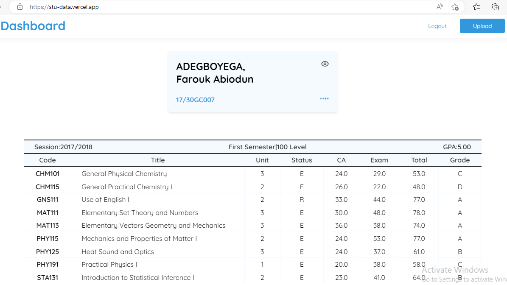
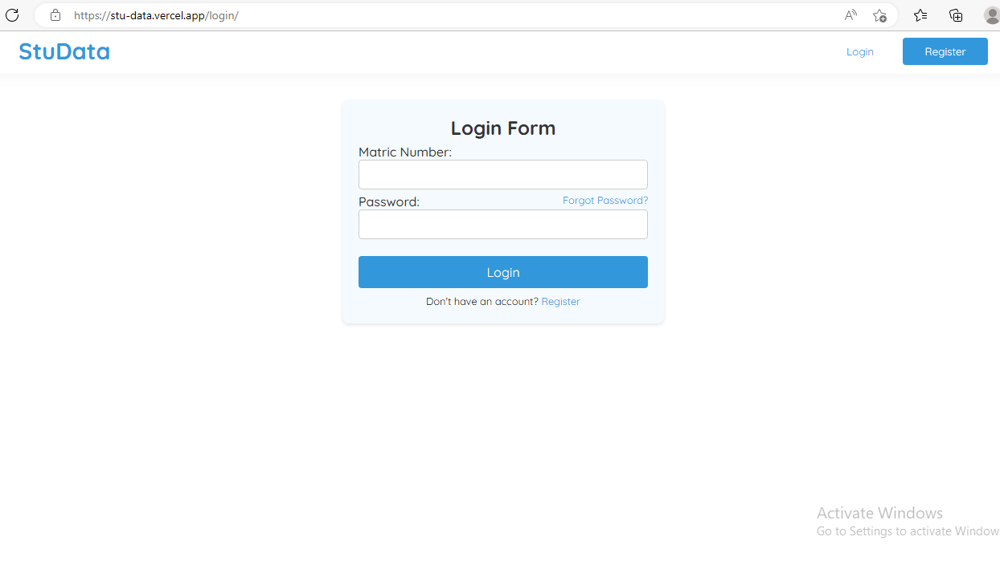

# StuData - University of Ilorin CGPA Calculator


<!--  -->

StuData is a web application built with Django for calculating the CGPA of students at the University of Ilorin, Nigeria. It allows users to register, log in, upload their result files, track their CGPA, and manage their results easily.

## Features

- User registration and login.
- Upload and manage semester results as HTML files.
- Calculate and display the CGPA.
- Edit individual course scores for result updates.
- Overview of all semester results.
- Course deletion option.
- Password recovery functionality.

## Getting Started

These instructions will help you set up and run the StuData web app on your local machine.

### Prerequisites

To run this project, you'll need:

- Python3.x (3.9+ recommended) installed on your system.
- Django installed.
- A database (SQLite or other supported databases).

### Installation

1. Clone the repository to your local machine:

   ```bash
   git clone https://github.com/farookie007/StuData.git


2. Navigate to the project directory:

   ```bash
   cd StuData

   ```

3. Install the required packages:

   ```bash
   pip install -r requirements.txt


4. Make migrations:

   ```bash
   python manage.py makemigrations

5. Apply database migrations:

   ```bash
   python manage.py migrate

6. Create a superuser for admin access:

   ```bash
   python manage.py createsuperuser

7. Start the development server:

   ```bash
   python manage.py runserver

8. Access the web app at `http://localhost:8000` and the admin panel at `http://localhost:8000/admin/`

## Usage

To use StuData:

1. **Registration and Login:**
   - Register for an account on the [web app](https://stu-data.vercel.app).
   - Log in with your credentials.

2. **Upload Result Files:**
   - Download your result page(s) from the school portal as HTML files.
   - Upload your result file(s) on the web app, either individually or together using the upload button.

3. **Dashboard:**
   - You'll be redirected to your dashboard, where you can:
     - View your CGPA.
     - See an overview of all your results.
     - Manually update course scores by clicking on the course and editing its field.
     - Delete a course from your results if needed.

4. **Refresh CGPA:**
   - Click the "Refresh" button on your dashboard to update your CGPA after manually updating a course.

5. **Password Recovery:**
   - Use the password recovery functionality if you forget your password.

Enjoy the convenience of tracking your CGPA and managing your results effortlessly with StuData.

## License

StuData is open-source software licensed under the [MIT License](LICENSE.md). You are free to use, modify, and distribute this software as per the terms of the license. See the [LICENSE.md](LICENSE.md) file for detailed licensing information.

## Acknowledgments

- Inspired by the need for an easy-to-use CGPA calculator at the University of Ilorin.
- Thanks to the Django community for the resources and support.
- Much gratitude to the students of the University of Ilorin for their feedback and suggestions.